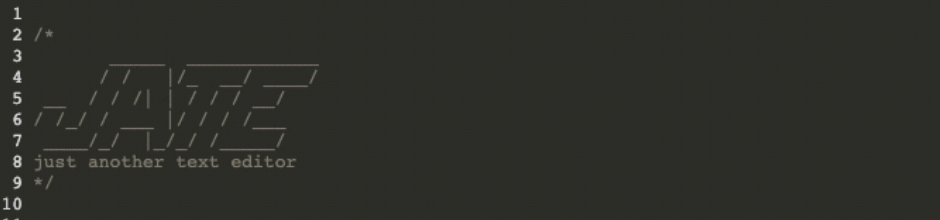

# Progressive-Web-App
Progressive web application was built to serve as a text editor in the browser to be used to your desire. You can install the application if stright to your computer as well.

## Installation
To start clone the application. In the root directory of the project open up the terminal. From there run "npm i" and "npm run start"

## ScreenShots

## Contributers
William Hirsch

## License 
MIT License 
